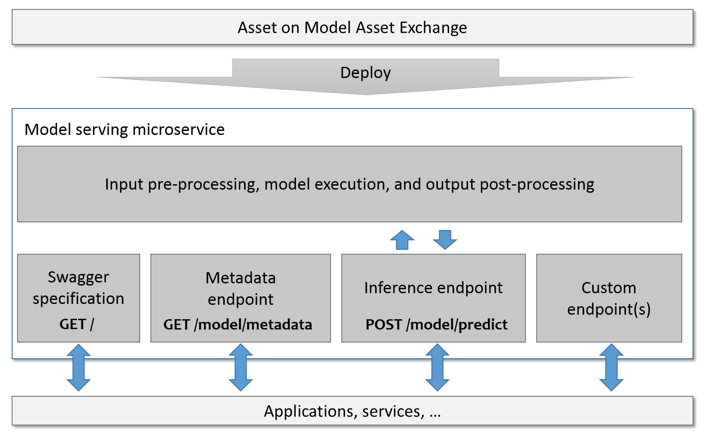
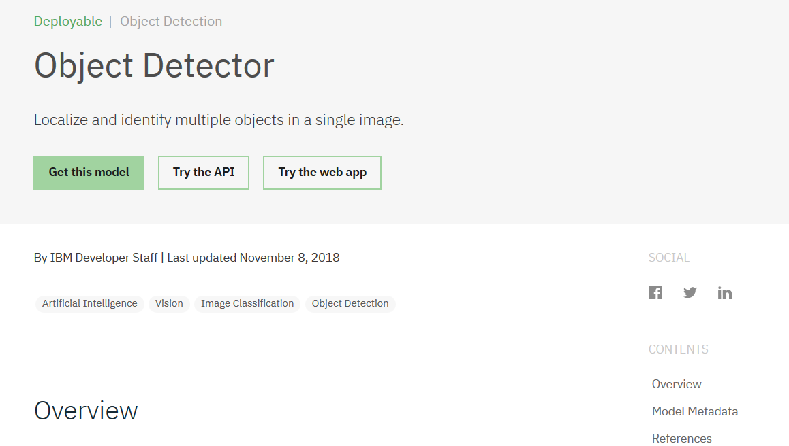

# Run a MAX model asset on Docker

Deployable MAX model assets implement microservices that you can run on Docker or Kubernetes.



In this module you will learn how to:
  * run a model microservice on Docker using a pre-built Docker image from Docker Hub
  * run a model microservice on Docker using a custom-built Docker image
  * explore the model microservice

If you just want to explore the functionality of a MAX model microservice in a local environment, you can run it by pulling the corresponding Docker image from [Docker Hub](https://hub.docker.com/u/codait/).

## Running the pre-built Docker image

The pre-built Docker images provide an easy way to explore a model microservice without the need to install any software (aside from Docker) on your machine. However, since the image is pre-built you cannot customize the microservice or review its implementation.

1. Open the [Object Detector model page](https://developer.ibm.com/exchanges/models/all/max-object-detector/). 

    

     > Note: You can explore the model service API of some models by clicking the _Try the API_ button. 

2. Locate the instructions to deploy the pre-built Docker image from Docker Hub and execute the listed [`docker run`](https://docs.docker.com/engine/reference/commandline/run/) command in a terminal window to start the microservice on your local machine.
   ```
   $ docker run -it -p 5000:5000 codait/max-object-detector
    ...
   ```

  > A status message is displayed once the container has started and the service is available, identifying the URL where the service can be accessed.

3. Open the displayed URL in a web browser.  
   ```
   ...
   Running on http://0.0.0.0:5000/ (Press CTRL+C to quit)
   ...
   ```
4. Explore the microservice specification.

   Each running microservice exposes at least the following three endpoints:

   * `GET /` - Returns the microservice's [Swagger](https://swagger.io/) specification.
   * `GET /model/metadata` - Returns information about the model that the microservice is serving, such as `name`, `description`, and `license`.
   * `POST /model/predict` - Returns the results of a prediction, given the provided input data. Supported input data types and formats vary by model. Refer to the service's Swagger endpoint description for details.

   Whenever a prediction is performed, the microservice takes care of 

   * transforming the input (e.g. an image, text or a sound file) into a format that can be consumed by the deep learning model,
   * invoking the deep-learning framework API that the model was implemented in, and 
   * filtering the model output and transforming it into an application-friendly format.

5. Evaluate the model.

   You can evaluate the model's prediction capability by invoking its `POST /model/predict` endpoint from the Swagger UI or by sending a request using any API client. You can find model specific example inputs in the models' GitHub repository.

   A simple curl-based example request for the Object Detector model might look as follows:

   ```
   $ curl -F "image=@assets/dog-human.jpg" -XPOST http://localhost:5000/model/predict
    {
     "status": "ok",
     "predictions": [
       {
          "label_id": "1",
          "label": "person",
          "probability": 0.944034993648529,
          "detection_box": [
              0.1242099404335022,
              0.12507188320159912,
              0.8423267006874084,
              0.5974075794219971
          ]
        },
      ...
   ```

6. Stop the microservice.

   * Use the [`docker ps`](https://docs.docker.com/engine/reference/commandline/ps/) command to list running containers.

     ```
     $ docker ps
     CONTAINER ID   IMAGE
     53...          codait/max-object-detector
     ```
   * Take note of the _CONTAINER ID_.
   * Run the [`docker stop`](https://docs.docker.com/engine/reference/commandline/stop/) command to stop the microservice.
  
     ```
     $ docker stop 53...
     ```

---
## Running a customizable Docker image

You can review the Docker image content, such as the model serving code implementation, or customize the Docker image by cloning the Model asset's GitHub repository.

1. On the [Object Detector model page](https://developer.ibm.com/exchanges/models/all/max-object-detector/) click the **Get this model** button to navigate to the model's [GitHub repository](https://github.com/IBM/MAX-Object-Detector#run-locally).

2. Follow the instructions to build the model. The build process typically comprises of two steps:
     * Clone the source to your local machine.
     * Build the Docker image.

    To build the Object Detector Docker image you'd run the following commands in a terminal window:
   ```
   $ git clone https://github.com/IBM/MAX-Object-Detector.git
    ... 
   $ cd MAX-Object-Detector
   ```
  
    The model serving code is typically implemented in Python using [Flask](http://flask.pocoo.org/) and a deep learning framework library, such as [TensorFlow](http://tensorflow.org/) or [PyTorch](https://pytorch.org/).

    > Note that the consumer of this service does not need to know which deep learning framework was used because the service API is framework agnostic.
 
    When you are ready to build the image, run the following command:

    ``` 
    $ docker build -t max-object-detector .
     ...
    ```
 
    During the build process the required dependencies are downloaded. 
    > Note that this might take some time depending on the image you are building.

    Once the build process has completed it's time to deploy.

3. Execute the listed [`docker run`](https://docs.docker.com/engine/reference/commandline/run/) command in a terminal window to start the microservice: 

   ```
   $ docker run -it -p 5000:5000 max-object-detector
    ...
   ```

   > A status message is displayed once the container has started and the service is available, identifying the URL where the service can be accessed.

4. Open the displayed URL in a web browser:  

   ```
   ...
   Running on http://0.0.0.0:5000/ (Press CTRL+C to quit)
   ...
   ```
  
5. Do not stop the container and do not terminate the terminal window. You will use the container in the next lab module.  

## Summary

In this module you
  * ran a model microservice on Docker using a pre-built Docker image from Docker Hub,
  * ran a model microservice on Docker using a custom-built Docker image, and
  * explored the model serving microservice.

Continue to the [next module](/modules/module2).
